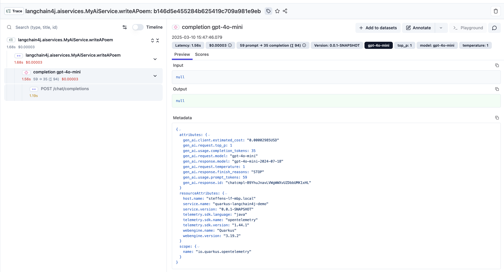

# Langfuse Quarkus LangChain4J Demo Application

## Prerequisites

- Java 21+
- An OpenAI Api Key

## How to run

1. Configure environment variables.

   ```
   export OPENAI_API_KEY=sk-xxx-...
   ```
2. Run the sample application via `./mvnw quarkus:dev`.
3. You should see something in the logs like this, indicating the URL/credentials of Langfuse:

   ```
   Dev Services for Langfuse started.
   Other applications in dev mode will find it automatically.
   For Quarkus applications in production mode, you can connect to this instance by starting you application with -Dquarkus.langfuse.base-url=http://localhost:42971.
   Log in with:
     Email: quarkus@quarkus.io
     Password: quarkuslangfuse 
   ```

4. Observe the new trace in the Langfuse web UI (indicated at the URL in the above message).


