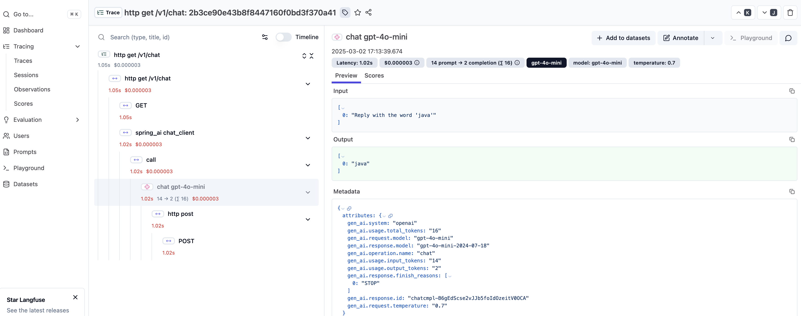

# Langfuse Spring AI Demo Application

## Prerequisites

- Java 21+
- Langfuse stack ([Cloud](https://cloud.langfuse.com/) or [Self-Hosted](https://langfuse.com/docs/deployment/self-host))
- Langfuse API Keys
- An OpenAI API Key

## Technology Stack

- **Spring Boot**: 4.0.3
- **Spring AI**: 2.0.0-M2
- **Java**: 21
- **OpenTelemetry**: Native support via `spring-boot-starter-opentelemetry`

## How to run

1. Configure environment variables to connect Spring AI demo app with Langfuse.
   ```bash
   export SPRING_AI_OPENAI_APIKEY="sk-proj-xxx"
   export OTEL_EXPORTER_OTLP_HEADERS_AUTHORIZATION="Basic $(echo -n "pk-lf-xxx:sk-lf-xxx" | base64)"
   ```

2. Run the sample application:
   ```bash
   ./mvnw clean install spring-boot:run
   ```

3. Call the chat endpoint:
   ```bash
   curl localhost:8080/v1/chat
   ```

4. Observe the new trace in the Langfuse web UI.

## Configuration

The application uses native OpenTelemetry support introduced in Spring Boot 4.x. The OTLP endpoint is configured in `OtelConfig.java` to point to `http://localhost:3001/api/public/otel/v1/traces`. 

For cloud deployments, modify the endpoint in `OtelConfig.java`:
- 🇪🇺 EU: `https://cloud.langfuse.com/api/public/otel/v1/traces`
- 🇺🇸 US: `https://us.cloud.langfuse.com/api/public/otel/v1/traces`
- 🏠 Local: `http://localhost:3000/api/public/otel/v1/traces` (>= v3.22.0)


