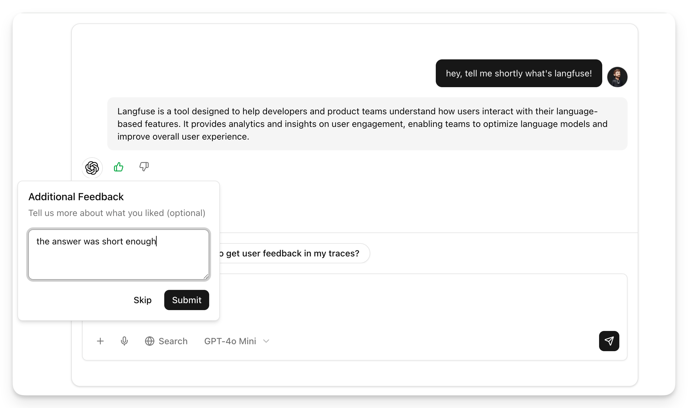
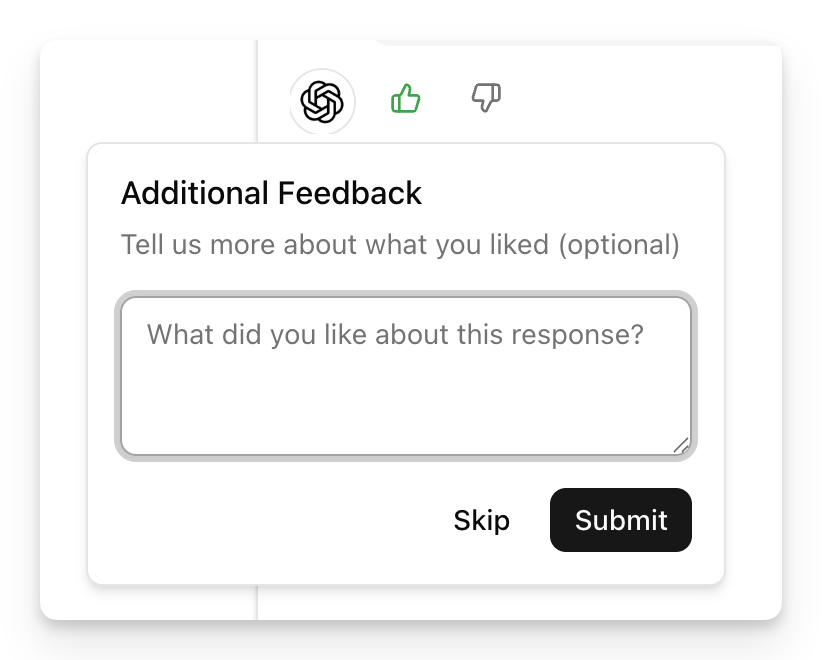
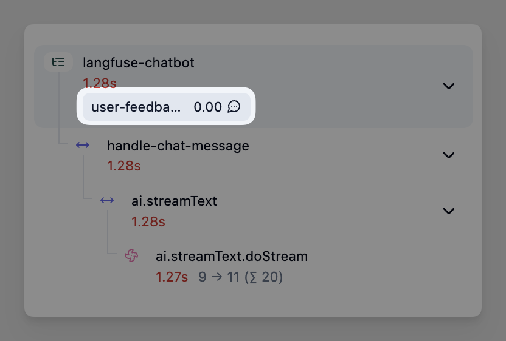

# User Feedback with Langfuse

A Next.js chat application built with the Vercel AI SDK 7 that records thumbs up/down feedback as [Langfuse scores](https://langfuse.com/docs/observability/features/user-feedback) on the trace of the rated answer.



## Key Features

- **Tracing**: Every chat response is traced in Langfuse, including the AI SDK model calls
- **Feedback-to-trace linking**: Each assistant message ID is the Langfuse trace ID of the response, so a rating can be attached to the right trace
- **Server-side feedback route**: Feedback is validated and recorded as a score by the server; no Langfuse keys reach the browser
- **Session tracking**: Messages of one chat are grouped into a Langfuse session

## Prerequisites

- Node.js 22+ (required by `@langfuse/vercel-ai-sdk`)
- OpenAI API key
- Langfuse API keys

## Setup

1. Install dependencies:

```bash
npm install
```

2. Create a `.env` file:

```bash
OPENAI_API_KEY=sk-...

LANGFUSE_PUBLIC_KEY=pk-lf-...
LANGFUSE_SECRET_KEY=sk-lf-...
LANGFUSE_BASE_URL=https://cloud.langfuse.com # 🇪🇺 EU region. 🇺🇸 US: https://us.cloud.langfuse.com
```

Get your Langfuse keys from your project settings in [Langfuse](https://cloud.langfuse.com).

## How to Run

```bash
npm run dev
```

Open [http://localhost:3000](http://localhost:3000) and chat with the assistant.

## How It Works

### 1. Tracing (`instrumentation.ts`)

`register()` sets up the OpenTelemetry tracer provider with the `LangfuseSpanProcessor` and registers the Langfuse integration for AI SDK 7 (`registerTelemetry(new LangfuseVercelAiSdkIntegration())`).

Next.js bundles `instrumentation.ts` separately from route handlers. The span processor is therefore kept as a process-wide singleton on `globalThis`, so the chat route flushes the same processor that `register()` attached.

### 2. One trace per answer (`app/api/chat/route.ts`)

The chat route wraps each response in `startActiveObservation` with `endOnExit: false`, ends the observation in `onFinish` / `onError` once the stream has finished, and flushes spans with `after()` so they are exported before a serverless function is frozen.

The trace ID becomes the assistant message ID:

```typescript
return result.toUIMessageStreamResponse({
  generateMessageId: () => traceId ?? generateId(),
});
```

`traceId` is only set when the trace is valid. Without active tracing, for example without Langfuse keys in local development, messages get a random ID and feedback on them is skipped.

### 3. Collecting feedback (`app/page.tsx`)

Thumbs up/down with an optional comment appear below each assistant message. The page posts `{ messageId, value, comment }` to `/api/feedback`.



### 4. Recording feedback as a score (`app/api/feedback/route.ts`)

The feedback route validates the request and creates a score on the trace:

```typescript
langfuse.score.create({
  id: `user-feedback-${messageId}`, // a changed rating updates the same score
  traceId: messageId,
  name: "user-feedback",
  value, // 1 = thumbs up, 0 = thumbs down
  dataType: "BOOLEAN",
  comment,
});
await langfuse.flush();
```

To send feedback directly from the browser instead, use the Langfuse browser SDK with your public key. See the [User Feedback docs](https://langfuse.com/docs/observability/features/user-feedback).

### 5. Viewing feedback in Langfuse

Feedback appears as the `user-feedback` score on each trace. Filter traces by `user-feedback`, add low-rated traces to an [annotation queue](https://langfuse.com/docs/evaluation/evaluation-methods/annotation-queues), or compare feedback over time in [Score Analytics](https://langfuse.com/docs/evaluation/scores/score-analytics).



## Learn More

- [User Feedback docs](https://langfuse.com/docs/observability/features/user-feedback)
- [Vercel AI SDK integration](https://langfuse.com/integrations/frameworks/vercel-ai-sdk)
- [Langfuse Documentation](https://langfuse.com/docs)
